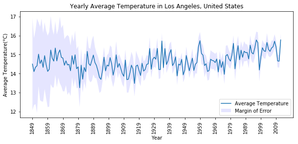
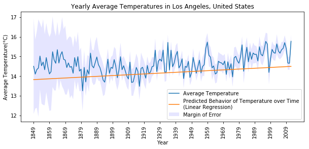
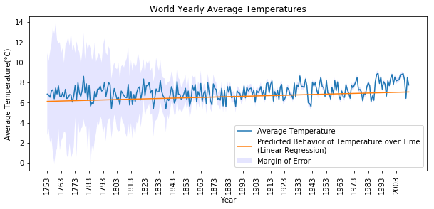
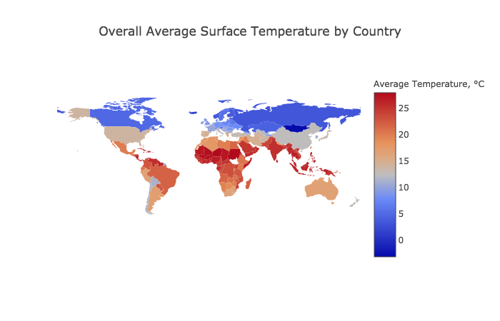

# climate-analysis

### How to run program:
- Download the following dataset and save it in a folder called data in your directory. [Get dataset](https://www.kaggle.com/berkeleyearth/climate-change-earth-surface-temperature-data/data) 
- Install numpy, pandas, scikit-learn, plotly and matplotlib for Python3. 
- Run climate-data.py using Python3.
- The program will take a few minutes to read and sort the dataset.
- Create a graph for city, country, or the world using the corresponding make_graph function. (Might take a few minutes.)
  - For example to make a graph for Los Angeles, type ```make_graph_city("Los Angeles", "United States")``` into your interpreter.
  - You can also make a graph for entire countries. Example: ```make_graph_country("China")```

*You can freely explore the dataset yourself using your Python interpreter/kernel. The reference for the pandas dataframe is stored in a variable called "data".*
 
### Interactive Map for Reference
- This is not part of the analysis and is meant to be a visual reference to help understand each country's geographical location and local climate.
- Run make_map.py to create an interactive map of average temperatures using plotly. This requires installing plotly for Python3 as well.
- To save time: You can simply view online at https://plot.ly/~urielu/1/  

## Project Details and Goals
My goal for this project is simple: I want to illustrate that the earth's overall temperature to slowly rising over time and how to identify climate change. According to the Intergovernmental Panel on Climate Change(IPCC), climate change is a persistent trend that occurs over a large period of time. Natural events such as El Nino cause short, temporal changes in average temperature so they are not classified as climate change. https://www.ipcc.ch/publications_and_data/ar4/wg1/en/ch9s9-1.html 

To accomplish my goal, I will perform a regression analysis to show that the average temperature of the earth is rising over time. The reason for chosing linear regression is due to its simplicity and its ability to show the relationship of an independant variable (time) have on a dependant variable (temperature).

I will write a collection of functions to prepare the climate data for analysis and visualization. The dataset is a csv file that contains the recorded average surface temperature of most major cities around the world since the 1750s. It comes from a reputable source called Berkeley Earth which compiles climate data from 16 different sources. The dataset has 8235082 rows and 7 labeled columns. The column values are all fairly straightforward. They are the following: AverageTemperature, AverageTemperatureUncertainty, City, Country, Latitude, and Longitude. AverageTemperatureUncertainity is the amount the recorded Average Temperature for that day may be off by.

I generalized my program so that it can produce a valid graph for any city or country that is given that exists in our dataset. It can also produce a graph for the entire world in general.

## Data Preparation
At the start of my program I sort all values by datetime which is costly, O(nLogn), but only needs to be performed once. Since it is necessary for my program to be efficient, I might as well do it at the beginning of the program to avoid repeatedly sorting the dataset every time you call a function.

I want to manipulate my data such that I have the average annual temperature for a given location, starting from the first year where data is consistently recorded. The reason for avoiding gaps in data is to properly fit our temperature values into our regression model. Any gaps will cause the training data and functions to become discontinuous which will cause the linear regression to fail. So when I am searching and cleaning the data, I need to make sure that there are no missing values and years. Finding and removing missing values using pandas is trivial. However, finding gaps between year requires manual scanning so I wrote a small helper function to recognize a missing year and return a dataset without gaps. After this initial prep, I am able to begin collecting the data I need from the dataset. To calculate annual temperature values, you take the mean of the average temperature of every month in the year. When working with data, taking the average of averages is not something you should do but calculating annual average temperatures is a notable, rare exception. For this reason, I perform these calculations manually rather than using Pandas since Pandas's built in mean function will not compute this kind of average without needing to creating multi-index or additional data frames which I want to avoid. This way, I save space and time by not having to create additional, unnecessary data structures. I also calculated the mean of AverageTemperatureUncertainty values in the same way so that I can also plot them on the graph to show the possible values the mean might be off by. After calculating the means, I have all the data I need to use for the data visualizations.

## Data and Regression Analysis


Now, I can plot my values into a graph and see that the output is. For the values in my data, the y-axis represents the temperature while the x-axis represents the year. The margin of error represents the possible real vlaues for the recorded temperature. This feature becomes irrelevant as technology improves and our ability to measure temperature becomes more reliable. There are always going to be occasional dips and shaky lines in our graph but this does not disagree with our definition of climate change as these only represent short trends in climate and not change over a large period of time as mentioned earlier in this analysis. Depending on the city/country chosen, it might be easier or harder to see how the graph is slowly rising, but for all graphs, you can see that the line graph is slowly increasing. However, we can communicate this trend much more clearer with a simple regression. 

A regression analysis demonstrates the relationship between a set of independent variables on a dependent variable. Using our real-world knowledge, we know that time will always be constant and moving forward irregardless of anything that occurs in our observable universe. We know that temperature can be influenced by a wide variety of variables including time (e.g. The temperature is lower at night when the sun is down, and higher in the day when the sun is above us). Therefore, we can perform regression using these two as our set of independent and dependent variables. The regression we will perform is a simple linear regression because our independent variable(temperature) is continuous variable (it can be any possible value). The data we have is already sufficient enough to fit into a linear regression model as a year is a representation of time.  A linear regression model statistically predicts possible y-values(temperature in our data) over time by recognizing patterns in our dataset. Of course, the predicted values in our model will not be very accurate because temperature is affected by numerous variables which even scientist struggle to predict. However, it will tell us if there is a correletion and predict the behavior of temperature over the course of time.



By plotting our predicted y-values onto the same graph, we can more clearly see the behavior of temperature over time. Since our regression line has a positive slope thus a positive correlation, this suggests that as time passes, temperature also rises. The predicted values also suggest that the Earth’s average temperature has risen by about 1 degree celsius since the 1750s. This strongly agrees with previous studies done on temperature trends and climate change around the world.



## Conclusion
We have clearly illustrated that the world's temperature is rising around the world using clear and easy-to-understand visuals. Linear regression tells us that there is a positive correlation between temperature and time meaning as time passes, temperature will increase.  If you plot multiple cities and countries and compare their climate data, you will see that the severity of the warming can vary. This is due to other factors such as geography (e.g. how close to a body of water it is). But we can conclude that there is general trend of rising temperatures over time, regardless of location. 

*To get a sense of a country's geographical location and climate, please refer to the map below.


*View the interactive version here: (https://plot.ly/~urielu/1/)*
## Possible Future Work and Improvements
A more significant analysis will look at temperature ranges (highs and lows) rather than average temperature. In reality, scientists are more interested in maximum and minimum temperature values and how they are changing over time. More extreme temperatures are more likely to have a significant, observable effect on ecosystems which we have already observed in recent times with melting ice caps in the Antarctic, more frequent, larger wildfires in California, etc. These observable effects have noticable and measurable consequences in forms such as rising sea levels(melting ice caps) and economic cost(tax money to remove/control wildfires) which can support stronger arguements advocating for action towards combating the effects and causes of climate change. That is beyond the scope of this exploratory project but would be interesting to pursue in a future project with additional resources.

Possible ideas and methods to improve and build upon this project might be to collect additional data such as ocean temperature, humidity, ect. As previously mentioned, it might be interesting to see how the maximum and minimum temperatures are changing. Maybe hotter days are getting hotter or more frequent. Additional data also gives us additional variables to be able to create more complicated multivariate regression models and other machine learning/ predictive models. There are also a number of other ways we can look at the data we already have such as looking at the average temperature of the seasons over the year which might also be another way of looking at extreme temperature.

Overall, I had a lot of fun learning how to explore data, analyze data, and reach conclusions for meaningful research.

All code was written by me. Dataset provided by kaggle.
